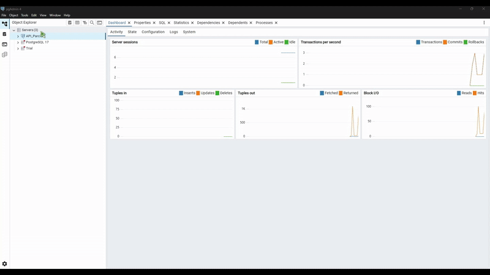

# API para el manejo de información en una biblioteca

## Información general:
El proyecto trata de una aplicación en la cual se pueden realizar las acciones básicas de una base de datos (CRUD) para registrar:
- Autores: con nombre, apellido y biografía.
- Editoriales: con nombre, dirección y teléfono
- Libros con título, resumen e IBSN, además de estar vínculados a un autor y editorial registrada.
- Miembros: con nombre, apellido, email y fecha de membresía
- Préstamos: con fecha del préstamo y fecha de devolución, además de estar relacionado con un libro y un miembro registrado.

Con estos datos también se pueden realizar búsquedas más avanzadas a partir de filtros que permitan buscar, libros por autor o editorial, o libros que no han sido devueltos, por ejemplo.

El proyecto se desarorllo en el lenguaje de programación Pyhton, y actualmente se encuentra desarrollado como un backend, cuyos endpoints pueden ser probados con Postman, en el enlace mostrado al final del documento.

## Funcionamiento:
La aplicación esta desarrollada en Django REST Framework, a partir de una base de datos local de tipo relacional, se permite administrar registros en 5 entidades; se pueden hacer operaciones CRUD a partir de diferentes endpoints creados como vistas, las cuales devuelven mensajes de éxito, error y validaciones para datos que no pueden repetirse, como es el caso de los emails en los miembros.

Se utilizan serializers para transformar los datos a modelos JSON y en cada endpoint se manejan errores y excepciones en este formato también.

Para más ejemplos sobre el funcionamiento y explicación de la API, se puede revisar la documentación realizada en Postman:
* [Enlace a la página de documentación](https://documenter.getpostman.com/view/43047808/2sB3HjM1qH)

## Instalación/Prueba
Para la instalación o prueba de este proyecto, se debe crear un servidor en PostgreSQL (pgAdmin4), con el nombre *"API_Parcial"*, y dentro del servidor crear una base de datos llamada *"gestion_biblioteca"*.



Una vez se ha hecho esto se pueden ejecutar los siguientes comandos en una terminal del IDE de preferencia, dentro de cualquier carpeta:
```
git init
git clone https://github.com/CristianR12/API_Parcial.git
cd API_Parcial
python -m venv .venv
.venv/Scripts/activate
pip install -r requirements.txt
```

Una vez se ha clonado el repositorio y se han instalado los requerimientos, se debe abrir el archivo *API_Parcial/api_project/api_project/settings.py*. En este archivo, se debe realizar una modificación en la línea 83, ya que en dentro de las comilllas que estan despues de los : se debe ingresar la contraseña que se estableció para PostgreSQL y el servidor.


Una vez se haya modificado la contraseña y se haya guardado el cambio, se puede ejecutar en la terminal los siguietnes comandos:

```
cd api_project
python manage.py makemigrations api_app
python manage.py migrate
cd api_app
py manage.py runserver
```

## Creadores
- Cristian Alejandro Rodriguez Rodriguez
- Sharon Ariadna Rincón Guerrero